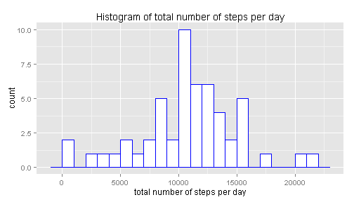
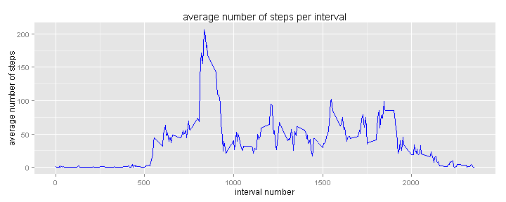
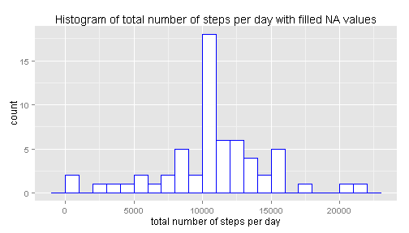
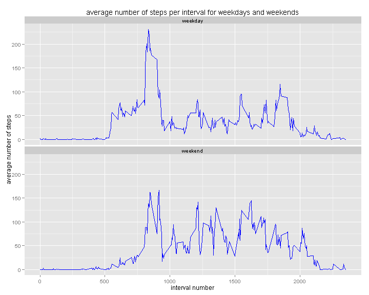

# Reproducible Research: Peer Assessment 1


## Loading and preprocessing the data

```r
# it is supposed that folder 'activity' is unzipped
activity <- read.csv("activity/activity.csv", colClasses = c("integer", "Date", 
    "integer"))
head(activity)
```

```
##   steps       date interval
## 1    NA 2012-10-01        0
## 2    NA 2012-10-01        5
## 3    NA 2012-10-01       10
## 4    NA 2012-10-01       15
## 5    NA 2012-10-01       20
## 6    NA 2012-10-01       25
```


## What is mean total number of steps taken per day?


```r
library(ggplot2)
activityNoNa <- activity[!is.na(activity$steps), ]
r1 <- tapply(activityNoNa$steps, activityNoNa$date, sum)

stepsMean <- format(round(mean(r1), digits = 2), scientific = F)
stepsMedian <- format(median(r1), scientific = F)

ggplot(NULL, aes(x = r1)) + geom_histogram(binwidth = 1000, fill = "white", 
    color = "blue") + labs(x = "total number of steps per day", title = "Histogram of total number of steps per day")
```

 


The mean of total number of steps taken per day is 10766 while the median is equal to 10765.


## What is the average daily activity pattern?

```r
r2 <- tapply(activity$steps, activity$interval, mean, na.rm = T)

intervalMax <- names(which.max(r2))
valueMax <- round(r2[[intervalMax]], digits = 2)

ggplot(NULL, aes(x = unique(activity$interval), y = r2)) + geom_line(color = "blue", 
    type = "l") + labs(x = "interval number", y = "average number of steps", 
    title = "average number of steps per interval")
```

 


835-th 5-minutes interval contains the maximum number (206.17) of steps averaged across all days.
## Imputing missing values

```r
naNumber <- nrow(activity) - nrow(na.omit(activity))
naPerDay <- tapply(activity$steps, activity$date, function(x) {
    length(x[is.na(x)])
})
uniqNaPerDay <- unique(as.vector(naPerDay))
naDays <- length(naPerDay[naPerDay == 288])
```

The total number of missing values in dataset is 2304. Moreover, if we calculate the number of steps with NA value per day we will found that this number is equal either 288 or 0. This means that there are 2304/288=8 days with complitelly missed step values and the other days have no missed values. Let's replace  each missed steps value with the mean of steps values for its interval over all days. 


```r
activityFilled <- activity
# when filling missing step values let's take advantage of the circumstances
# that there are 8 days with complitelly missed step values and the other
# days have no missed values
activityFilled$steps[is.na(activity$steps)] <- r2

r3 <- tapply(activityFilled$steps, activityFilled$date, sum, na.rm = T)
stepsMean3 <- format(round(mean(r3), digits = 2), scientific = F)
stepsMedian3 <- format(median(r3), scientific = F)

ggplot(NULL, aes(x = r3)) + geom_histogram(binwidth = 1000, fill = "white", 
    color = "blue") + labs(x = "total number of steps per day", title = "Histogram of total number of steps per day with filled NA values")
```

 

Now the mean of total number of steps taken per day is 10766 and the median is equal to the same number 10766. Comparing the histograms with NA values presented and Na values replaced one can see that the number of days with total steps in the interval  1000-1100  increased from 10 to 18. 

## Are there differences in activity patterns between weekdays and weekends?

```r
Sys.setlocale("LC_TIME", "English United States")
```

```
## [1] "English_United States.1252"
```

```r
activityFilled$day <- apply(activityFilled, 1, function(row) {
    if (weekdays(as.Date(row[2])) %in% c("Sunday", "Saturday")) {
        "weekend"
    } else {
        "weekday"
    }
})

r4 <- tapply(activityFilled$steps, list(activityFilled$day, activityFilled$interval), 
    mean)

dataWeekday <- data.frame(interval = unique(activityFilled$interval), meanSteps = r4["weekday", 
    ], day = "weekday")

dataWeekend <- data.frame(interval = unique(activityFilled$interval), meanSteps = r4["weekend", 
    ], day = "weekend")

data <- rbind(dataWeekday, dataWeekend)
ggplot(data, aes(x = interval, y = meanSteps)) + geom_line(color = "blue", type = "l") + 
    labs(x = "interval number", y = "average number of steps", title = "average number of steps per interval for weekdays and weekends") + 
    facet_wrap(~day, nrow = 2, ncol = 1)
```

 

